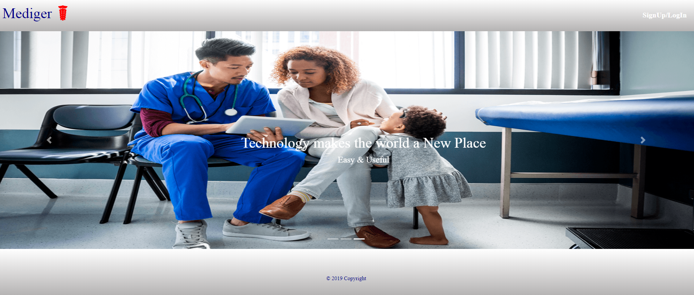
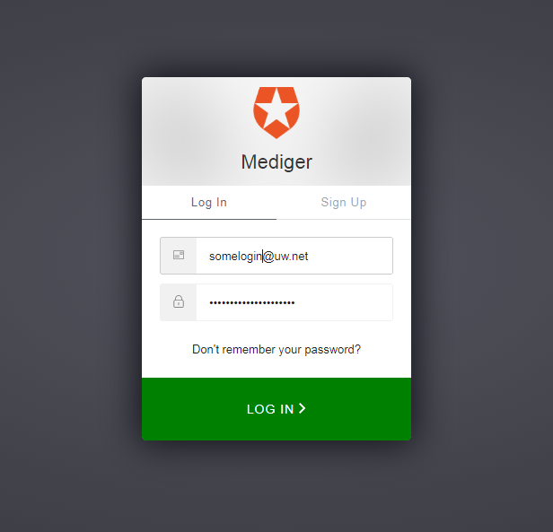
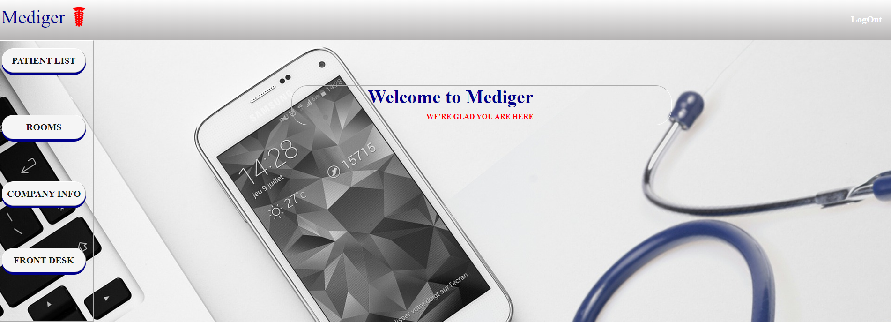
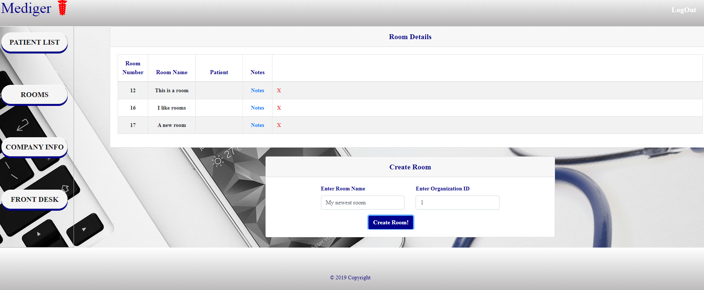
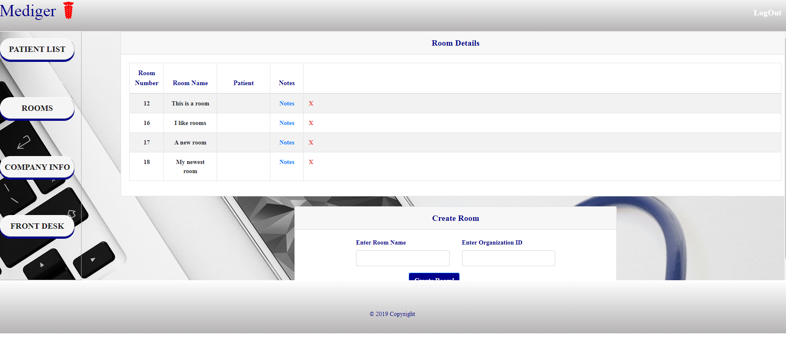
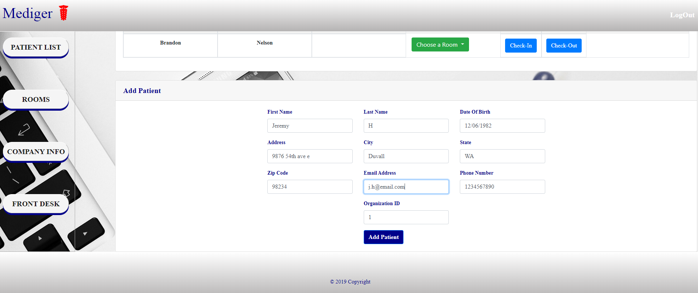
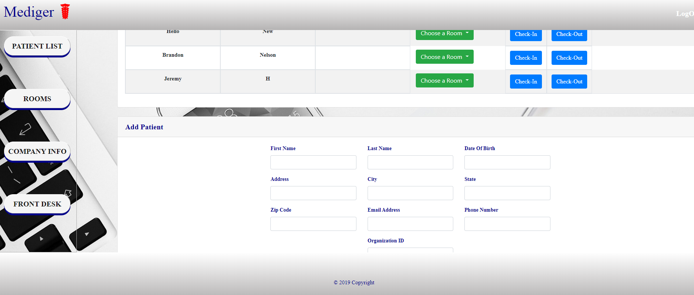
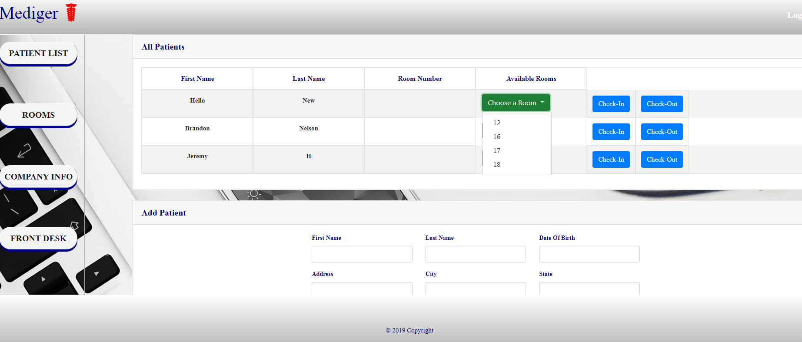
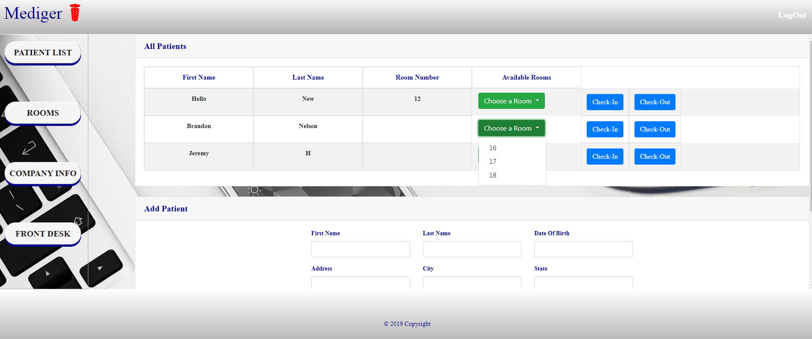
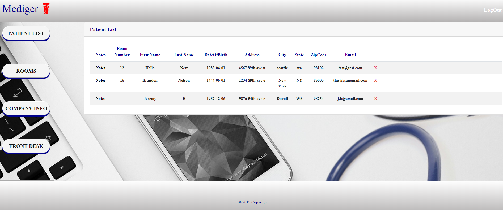

# Real_Reporting_Portal

## Overview
Mediger is a system designed to handle medical facilities patient information. This system has the capability to sign up a new patient, check them in to a room, allow notes to be made to the patient file as well as check them out when they have completed services. This app uses Node.js, Express,React, Sequelize and MySQL. 

Below is an example of how you would interact with this application.

#### -Landing Page-

Here you would be introduced to Mediger and have the opportunity to log in to the site. 

#### -Login/Registration Page-
The registration page utilizes 0Auth - If you have an existing account you would log in, otherwise you would first sign up. 

On login there is user validation to ensure username and password are correct.

#### -Admin Page- 

Here is what the user will see when they successfully log in. There are a number of options the user can choose - they can view current patient lists, go see what rooms are currently in use, they can enter company info or they can use the front desk. 

#### -Room Page- 

Adding rooms would be one of the first things you do when using this app as part of the overall setup of your organization. Any time you add a room it will modify the state, and react will update the page reflecting the new room. 

Users are also able to see who is checked in to the room currently and access any notes that patient has on file. 
Finally, if a room was added by mistake, users have the ability to delete the room on this page. 

#### -Front Desk Page-
The front desk is where the user will spend most of their time. 

Here you can add a new patient to the system:

Once added, similar to the room view the page will automatically update reflecting the new entry allowing the front desk to then proceed to check them in to any rooms that are available

The check-in process is relatively simple. There is a dropdown next to each user which when clicked will show all rooms that are currently available. The user would select the appropriate room and click the check-in button. The check-in is immediate and the room number is then reflected on the patient line. 

If the user needed to check in another patient, when they click the dropdown the room that was just checked in to would not be present. 

#### -Patient List Page-
This view offers a more comprehensive patient view. All of the details that were captured at the front desk are now displayed here as well as access to the notes section.

Patients can be deleted from the system here and if that action is taken, after the user confirms the action, the patient will be removed from the database along with all of their notes, and if that patient was still assigned to a room, that room will be modified and marked as available. 

#### -Notes Page-
Here users can make notes that are associated only with those patients. 

Should a note be written in error, the user does have the option of deleting it from their record. 
